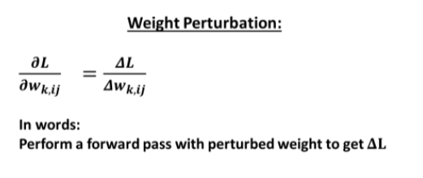

# 3 W's and an H
In this post, I wanted to go through *when*, *what*, *why* and *how* did perturbation techniques actually come about.

---
## General architecture


### Notation
$H$ -  depth of the neural network

$n_i$ - number of nodes in the $i^{th}$ layer(depth i),  $1 \leq i \leq H$

$W_i$ - weight vector of the  $i^{th}$ layer(depth i),  $1 \leq i \leq H$ i.e connects the $(i-1)^{th}$ layer to the $i^{th}$ layer

$w_{k, ij}$ - weight of the $k^{th}$ layer(depth k) connecting the $i^{th}$ node of the $(k-1)^{th}$ layer to the $j^{th}$ node of the $k^{th}$ layer 

$z^{(k)}_{j}$ - value of the $j^{th}$ node before activation function at depth k of the neural network.

$z^{(k)}$ - $\{z^{(k)}_{j}| \forall j, 1 \leq j \leq n_j\}$

$x_{k, j}$ - value of the $j^{th}$ neuron after activation function at depth k of the neural network.

$x_k$ - $\{ x_{k, j}| \forall j, 1 \leq j \leq n_j\}$, $0 \leq k \leq H$

$x_0$ - the input

$y$ - training outuput

$x_H$ - model output

---
## Back Propagation - A quick recap


So, the main aim in back-propagation is to found out the **gradient** of the loss function with respect to the weights of the neurons in our CNN architecture. Having found out this we can then perform gradient descent and try to find out the new updated weights.
$$ \Delta w_i = -\eta \frac{\partial L}{\partial w_i}$$
where L is the loss function and $w_i$ is the weight of the neuron.

Using chain rule again and again we get the following,


So as the depth of our neural network increases at each level of the network we need to perform the above update. And so its clear why this requires such precise calculation power since this techique is susceptible to error propagation.

---
## Weight perturbation



In Weight perturbation, we approximate the gradient as,

$$ \frac{\partial L}{\partial w_{k, ij}} \approx \frac{\Delta L}{\Delta w_{k, ij}} = \frac{L(w_{k, ij} + pert_{k, ij}) - L(w_{k, ij})}{pert_{k, ij}}$$

Thus, the update rule becomes,

$$ \Delta w_{k, ij} = - \eta \times \frac{\Delta L}{\Delta w_{k, ij}}$$
$$ \implies \Delta w_{k, ij}  = - \eta \times \left (\frac{L(w_{k, ij} + pert_{k, ij}) - L(w_{k, ij})}{pert_{k, ij}} \right) $$

We can rewrite the above equation as follows,
$$ \Delta w_{k, ij} = G(pert_{k, ij})\Delta L(w_{k, ij}, pert_{k, ij})$$

>Notice that we only need to perform forward passes in this method - no back propagation is required. This is good news in terms of hardware since now we need only unidirectional circuit as compared to bi-directional cicuitry required in the case of back propagation.

### WP Algo at a very simplistic level
```python
for each pattern p {
    E = ForwardPass()
    ClearDeltaWeights()
    for each weight w_k_ij do {
        Epert = ApplyPerturbation(w_k_ij)
        DeltaError = - eta * DeltaError/Perturbation
        RemovePerturbation(w_k_ij)
    }
}
```
---

## Node Perturbation


>Correction in this formula, see the next formula !!

Here, we want to approximate the gradient of the node output with respect to the loss function. Thus,
$$ \frac{\partial L}{\partial w_{k, ij}} \approx \frac{\Delta L}{\Delta z_{k,j}} \times x_{k-1, i}$$

Thus, the update rule becomes,
$$ \Delta w_{k, ij} = - \eta \times \frac{\Delta L}{\Delta z_{k,j}} \times x_{k-1, i}$$
$$ \implies \Delta w_{k, ij}  = - \eta \times \left (\frac{L(z_{k,j} + pert_{k, ij}) - L(z_{k,j})}{pert_{k, ij}} \right)\times x_{k-1, i} $$

We can rewrite the above equation as follows,
$$ \Delta w_{k, ij} = G(pert_{k, ij}) \times \Delta L(z_{k,j}, pert_{k, ij}) \times x_{k-1, i}$$
---
## The Underlying principle - *Minimal Disturbance Principle*